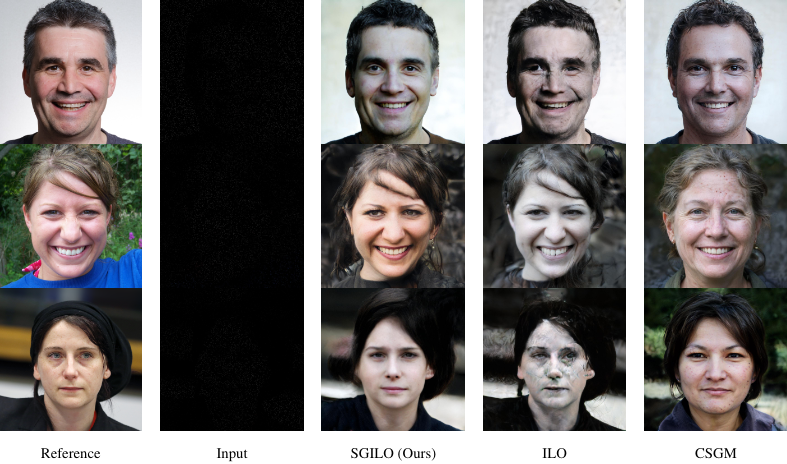
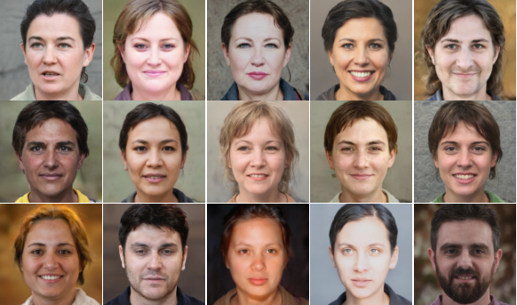
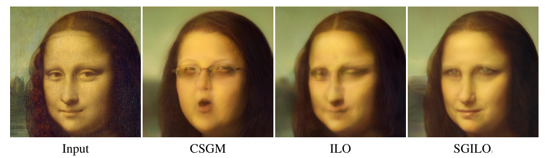

<center> <h2> Score-Guided Intermediate Layer Optimization: Fast Langevin Mixing for Inverse Problems </h2> </center>


This repo contains the official implementation for the paper: 
[Score-Guided Intermediate Layer Optimization: Fast Langevin Mixing for Inverse Problems](https://arxiv.org/abs/2206.09104).

Authored by: [Giannis Daras](https://scholar.google.com/citations?user=LaScvbQAAAAJ&hl=en) (\*), [Yuval Dagan](https://scholar.google.co.il/citations?user=X91gWisAAAAJ&hl=en) (\*), [Alexandros G. Dimakis](https://scholar.google.com/citations?user=JSFmVQEAAAAJ&hl=en), [Constantinos Daskalakis](https://scholar.google.com/citations?user=iTv2cOgAAAAJ&hl=en)

(\*): equal contribution.


--------------------
We use diffusion models to regularize the solutions of GANs for inverse problems (e.g. inpainting, colorization, denoising, etc). 

<div class="center">  </div>

A GAN can be decomposed into multiple intermediate generators, e.g. $G_1, G_2$ as shown below.
<div class="center">  

$G_1$ typically has a low-dimensional input space which limits the expressitivity of the whole generator. 

ILO [[1]](https://arxiv.org/abs/2102.07364), [[2]](https://github.com/giannisdaras/ilo) proposes to throw away $G_1$ (after training) and optimize over the input space of $G_2$, constrained in an $l_1$ expansion of the range of $G_1$. The set of potential solutions to an inverse problem is the green shaded area shown above.

We argue that this handcrafted sparse prior can be replaced with a more powerful neural prior, coming from score-based/diffusion models. Specifically, we learn the distribution of latents in the input space of $G_2$ that correspond to natural images. In the figure, this is shown with the red level sets. We use the score network to regularize solutions of inverse problems in the input space of $G_2$.


## Code Structure

### Scripts

* `eval_score_based.py`: Generates images using a pre-trained score-based network on the latent space of StyleGAN
* `solve_inverse.py`: Solves inverse problems with SGILO.

### StyleGAN folders and files
* `torch_utils/`: torch utilities, from StyleGAN repo.
* `stylegan`: architecture for StyleGAN
* `dnnlib`: library for faster GPU operationss

### Score-based models

The code for score-based models is under `score/` and it is heavily based on [this](https://github.com/yang-song/score_sde_pytorch) open-source implementation.


### Misc
* `configs/`: configuration files for scripts and trained networks.
* `paper_figs`: figures from the paper.
* `outputs/`: it is created automatically when a script is running. Here you can find the artifacts of the script, e.g. reconstructed images/latents/etc.
* `checkpoints/`: folder with checkpoints. See Installation section for more.
* `images/`: folder with example images.
* `lpips/`: implementation of lpips loss.
* `utils.py`: Utility functions shared among the scripts.
*  `dataloaders.py`: dataloaders for different datasets.

## Installation
First, install all python requirements:

`pip install -r requirements.txt`

<span style="color:red"> [Note]: </span> Depending on your cuda version, this command might fail installing torch properly. If that's the case, comment out torch from the requirements, [install it manually](https://pytorch.org/get-started/locally/) and re-run.


Then, you can download the pre-trained StyleGAN and score models, either [manually](https://drive.google.com/file/d/1GaFjosEsZhrt6xDd3YctR3EVSGFnlAOP/view?usp=sharing) or by running the following command in your terminal:

`gdown --id 1GaFjosEsZhrt6xDd3YctR3EVSGFnlAOP`

This command will download an $\approx 1.7$ GB zip file, that you will need to unzip in the root folder of the project. To do so, you can run in your terminal:

`unzip checkpoints.zip`


## Pre-trained models
The pre-trained models are score-networks that are approximating the distribution of latents in some layer of StyleGAN that correspond to natural images. All the networks are trained with the Variance Preserving SDE in the corresponding latent space. The dataset for some of the networks are either: i) activations that correspond to Gaussian inputs or ii) inverted latents from FFHQ. Models trained with i) have a `syn_` prefix in the name of the corresponding checkpoint.

We provide the following checkpoints:

*  `checkpoints/score_based/vp/latent.pth`: trained to learn the distribution of [CSGM](https://arxiv.org/abs/1703.03208) (layer 1) inversions of StyleGAN. 
* `checkpoints/score_based/vp/layer1.pth`: trained to learn the output distribution layer1.
* `checkpoints/score_based/vp/layer2.pth`: trained to learn the output distribution layer2.
* `checkpoints/score_based/vp/layer3.pth`: trained to learn the output distribution layer3.
* `checkpoints/score_based/vp/syn_layer3.pth`: trained to learn the output distribution layer3, but the inputs are Gaussian.


## Unconditional Generation

One can use the score-models to do unconditional generation. This can give a sense of how well these models have learned the latent distribution. Networks that lead to good generations can generally be trusted more as regularizers for inverse problems.

To test a model, you can simply run:

`python eval_score_based.py --gen_conf=/path/to/model/conf`.

For example, running:

`python eval_score_based.py gen_conf=./configs/trained_networks/syn_layer3.yaml`

generates images using samples from the pre-trained score-network on the output space of layer 3.

There are two modes for unconditional generation: hot and cold start. These modes are controlled by whether `sampling.hot_sampler` equals `True` or `False` in the corresponding yaml file for the model. When `hot_sampler` is True, we start from a realizable latent from StyleGAN and we adapt it by using the final learned vector field (vector field of clean images) of the diffusion network. This can be useful for many applications, such as image naturalization or diverse reconstructions. 

When `hot_sampler` is False, we start with just a Gaussian latent and we "denoise" it all the way using the score-network. This leads to slower sampling, since we need to solve the whole reverse SDE before we feed the final sample to the GAN.

Example generations:



Example naturalizations:



## Conditional Generation (Solving Inverse Problems)

To solve an inverse problem, we use the script: `solve_inverse.py`, which is configured by the config file `configs/solve_inverse.yaml`. The configuration file values can be overwritten by command-line arguments.

Some important configuration values to adjust:

* `input_folders:` a list of input folders from which the images to be reconstructed are taken. Images should have extensions `.png` or `.jpg`.
* `operators.operator_type`: Which operator to use to corrupt the image. Choose from: {dummy, downsampler, circular, colorizer} or implement your own in `utils.py`.
* `operators.forward_measurements`: if true, it assumes that the images in `input_folders` are not corrupted. Otherwise, it assumes that the images are already corrupted.
* `latent_temperature`: a list of values that contain the weight of the score for the regularization of $z$ for inversion of each layer. Smaller values: prior is less important.
* `gen_temperature`: a list of values that contain the weight of the score for the regularization of the outputs of previous layers. Smaller values: prior is less important.
* `steps`: a list of how many steps to run per layer.

## References

If you find this work useful, please consider citing the following papers:

```bib
@misc{daras_dagan_2022score,
    title={Score-Guided Intermediate Layer Optimization: Fast Langevin Mixing for Inverse Problems},
    author={Giannis Daras and Yuval Dagan, Alexandros G. Dimakis, Constantinos Daskalakis},
    year={2022},
    eprint={4362205},
    archivePrefix={arXiv},
    primaryClass={cs.LG}
}
```

```bib
@misc{daras2021intermediate,
    title={Intermediate Layer Optimization for Inverse Problems using Deep Generative Models},
    author={Giannis Daras and Joseph Dean and Ajil Jalal and Alexandros G. Dimakis},
    year={2021},
    eprint={2102.07364},
    archivePrefix={arXiv},
    primaryClass={cs.LG}
}
```

```bib
@inproceedings{
  song2021scorebased,
  title={Score-Based Generative Modeling through Stochastic Differential Equations},
  author={Yang Song and Jascha Sohl-Dickstein and Diederik P Kingma and Abhishek Kumar and Stefano Ermon and Ben Poole},
  booktitle={International Conference on Learning Representations},
  year={2021},
  url={https://openreview.net/forum?id=PxTIG12RRHS}
}
```

## Acknowledgments

The repository is heavily based on the following open-source implementations:

* [https://github.com/yang-song/score_sde_pytorch](https://github.com/yang-song/score_sde_pytorch)
* [https://github.com/giannisdaras/ilo](https://github.com/giannisdaras/ilo)
* [https://github.com/rosinality/stylegan2-pytorch](https://github.com/rosinality/stylegan2-pytorch)

This research has been supported by NSF Grants CCF 1763702, 1934932, AF 1901281, 2008710, 2019844 the NSF IFML 2019844 award as well as research gifts by Western Digital, WNCG and MLL, computing resources from TACC and the Archie Straiton Fellowship. This work is also supported by NSF Awards CCF-1901292, DMS-2022448 and DMS2134108, a Simons
Investigator Award, the Simons Collaboration on the Theory of Algorithmic Fairness, a DSTA
grant, the DOE PhILMs project (DE-AC05-76RL01830).
